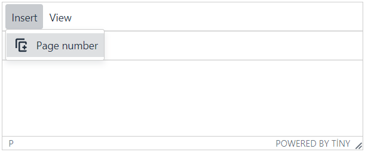
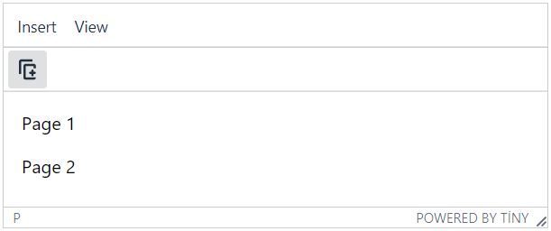
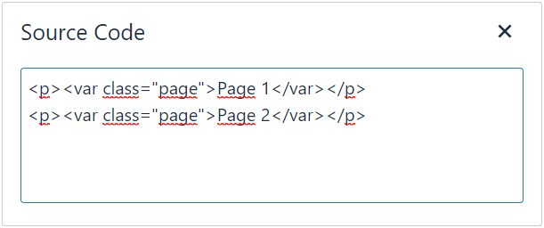

# TinyMCE5-Page-Number
TinyMCE 5 WYSIWYG editöründe sayfaya sayfa numarası eklenmek istendiğinde Insert(Ekle) menüsü altında bulunan Page number(Sayfa numarası) menü elemanına basılabilir. Menu elemanına her basıldığında sayı bir artacaktır. Sayfa numarası için
&lt;var class="page"&gt; HTML elementi kullanılmıştır.

Türkçe kullanabilmek için dil dosyasının sonuna aşağıdaki satırları ekleyebilirsiniz:

```
"Page number": "Sayfa numaras\u0131",
"Page": "Sayfa",
```

pagenumber.js dosyasını indirip aşağıdaki şekilde kaydedebilirsiniz:

```
<!DOCTYPE html>
<html lang="tr" >
<head>
  <meta charset="utf-8" />
  <meta name="viewport" content="width=device-width, initial-scale=1.0" />

  <script src="https://.../tinymce/5/tinymce.min.js" ></script> <!-- use tinymce actual version. -->
  
  <script>
  tinymce.init({
  selector: "textarea",  // change this value according to your HTML.

  plugins: [
    "code pagenumber",
  ],

  toolbar: "pagenumber",

  menubar: "insert view",

  menu: {
    insert: { title: "Insert", items: "pagenumber" },
    view: { title: "View", items: "code" }, // I add this to show the codes.
  },
  });
  </script>
  
  <script src="pagenumber.js"></script> <!-- save plugin here -->

</head>
<body>

  <form method="post">
    <textarea>metin...</textarea>
  </form>

</body>
</html>
```
## Sayfa Numarası Ekle:

## Sayfa Numarasının Görünüşü:

## Kaydedilen metnin kaynak kodları:

